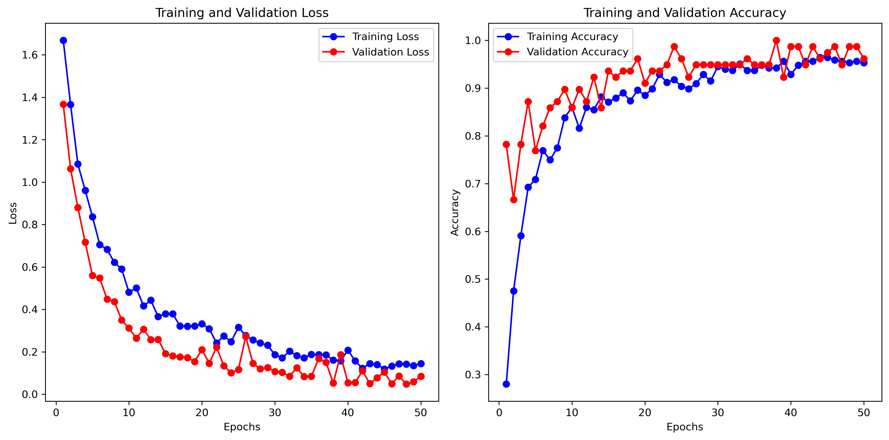

# Apple Breeds Classification

This project aims to build a model to classify apple breeds from images using various machine learning and deep learning techniques, including Convolutional Neural Networks (CNN), Support Vector Machines (SVM), and k-Nearest Neighbors (k-NN).



## Requirements

This project requires Python 3.8 or higher and several libraries for machine learning and data processing. To install the required libraries, run:

```bash
pip install -r requirements.txt


